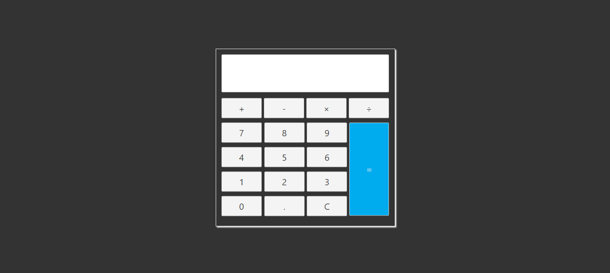

# CALCULADORA COM SVELTE
👨‍🏫CALCULADORA SIMPLES COM SVELTE.

 <br> 
 <br> 

## DESCRIÇÃO:
   - Este é um aplicativo de calculadora simples desenvolvido em Svelte. Ele permite que você realize operações básicas de adição, subtração, multiplicação e divisão.

   - A calculadora tem uma interface simples com uma tela de exibição onde os números e operações são mostrados.

   - Abaixo da tela de exibição, existem botões para números, operações matemáticas e um botão de igual.

## EXECUTANDO O PROJETO:
1. **Instalar as dependências do projeto**:
   - Execute o comando no diretório `CODIGO/`:
     ```cmd
     npm install
     ```
   Este comando instala todas as dependências listadas no arquivo `package.json` do seu projeto. 

2. **Executando o Aplicativo:**
   - Ainda no diretório `CODIGO/`, abra o terminal ou prompt de comando e digite o seguinte comando:
   ```bash
   npm run dev
   ```
   - Acesse o aplicativo no navegador visitando `http://localhost:8080/`.

3. **Usando o APP:**
   1. **Realizando cálculos:**
   - Para inserir números, clique nos botões numéricos de 0 a 9.
   - Para inserir um ponto decimal, clique no botão '.'.
   - Para limpar a tela e começar um novo cálculo, clique no botão 'C'.
   - Para realizar operações matemáticas, clique nos botões de operação (+, -, ×, ÷).
   - Para obter o resultado da operação, clique no botão de igual (=).

   2. **Exemplo de uso:**
      - Digite os números desejados clicando nos botões numéricos.
      - Selecione a operação desejada clicando nos botões de operação.
      - Para obter o resultado, clique no botão de igual.

   Por exemplo, para calcular a soma de 5 e 3:
      - Clique no botão '5'.
      - Clique no botão '+'.
      - Clique no botão '3'.
      - Clique no botão '=' para ver o resultado na tela de exibição.
   
## NÃO SABE?
- Entendemos que para manipular arquivos em `HTML`, `CSS` e outras linguagens relacionadas, é necessário possuir conhecimento nessas áreas. Para auxiliar nesse aprendizado, oferecemos alguns subsidios:
* [CURSO DE HTML E CSS](https://github.com/VILHALVA/CURSO-DE-HTML-E-CSS)
* [CURSO DE JAVASCRIPT](https://github.com/VILHALVA/CURSO-DE-JAVASCRIPT)
* [CURSO DE NODEJS](https://github.com/VILHALVA/CURSO-DE-NODEJS)
* [CURSO DE SVELTE](https://github.com/VILHALVA/CURSO-DE-SVELTE)
* [CONFIRA MAIS CURSOS](https://github.com/VILHALVA?tab=repositories&q=+topic:CURSO)

## CREDITOS:
- [PROJETO FEITO PELO VILHALVA](https://github.com/VILHALVA)
- [VEJA O VIDEO DESSE PROJETO](https://youtu.be/NbLLEO9mgtM?si=78P8b4wuzuyjWFBV)
- [VEJA O CÓDIGO FONTE DESSE PROJETO](https://codingflag.blogspot.com/2020/10/how-to-design-calculator-app-using-html-css-and-javascript-in-svelte.html)
- [VEJA A PLAYLIST DE PROJETOS](https://youtube.com/playlist?list=PLVGpQnv1Jm4zF85nLVJU2hvqg3CBa6QQd&si=64Ou6dIY4dYhOlEd)


